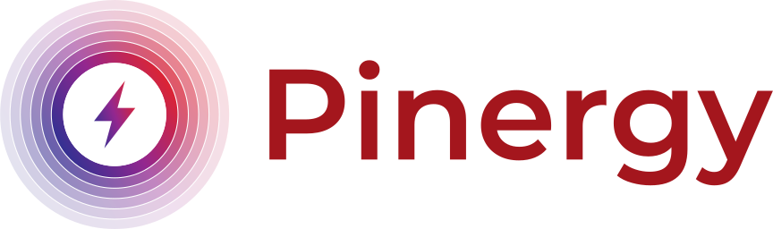
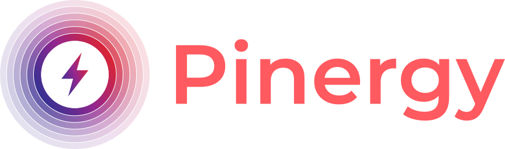

# Branding

The integration ships with a small set of brand assets. They live in two places, kept in sync:

- [`custom_components/pinergy/brand/`](https://github.com/Irishsmurf/ha-pinergy/tree/main/custom_components/pinergy/brand)
  — used by Home Assistant for the integration.
- [`assets/brand/`](https://github.com/Irishsmurf/ha-pinergy/tree/main/assets/brand) — mirrored
  for documentation and the README.

## Assets

| Asset | Preview | Usage |
|---|---|---|
| **Icon** | { width="64" } | Square mark shown for the integration in Home Assistant. |
| **Logo** | { width="200" } | Full lockup for light backgrounds. |
| **Dark logo** | { width="200" } | Full lockup for dark backgrounds. |

Each asset ships as `.svg`, `.png`, and `@2x.png` (high-DPI) variants.

## The mark

The icon is an original **halo** mark: concentric rings whose colour sweeps along a diagonal
gradient from indigo through magenta to red, fading outward in opacity toward a white core, with
an energy bolt at the centre. The wordmark is *Montserrat SemiBold* (SIL Open Font License),
converted to paths so the SVG renders without the font installed.

### Palette

The gradient runs across three stops, with a darker red used for the wordmark:

| Swatch | Hex | Role |
|---|---|---|
|  | `#2E3192` | Indigo — gradient start, docs primary |
|  | `#93278F` | Magenta — gradient mid, docs accent |
|  | `#E1242D` | Red — gradient end |
|  | `#A4161D` | Deep red — wordmark |

These same colours drive this documentation site's theme (see
[`docs/stylesheets/brand.css`](https://github.com/Irishsmurf/ha-pinergy/blob/main/docs/stylesheets/brand.css)).

## Usage guidelines

- Use the **light logo** on light backgrounds and the **dark logo** on dark backgrounds; prefer
  the SVG where the renderer supports it.
- Don't recolour, stretch, or crop the mark — swap to the appropriate light/dark variant
  instead.
- Keep clear space around the lockup roughly equal to the height of the halo.

!!! warning "Unofficial assets"
    These are **original, unofficial** assets created for this community project. They are
    *inspired by* Pinergy's visual identity but are not Pinergy's official logo. "Pinergy" and
    any official marks belong to their respective owners; nothing here implies affiliation or
    endorsement.
